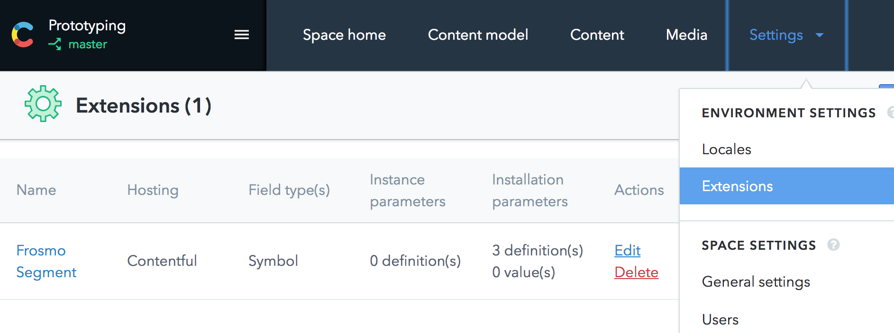
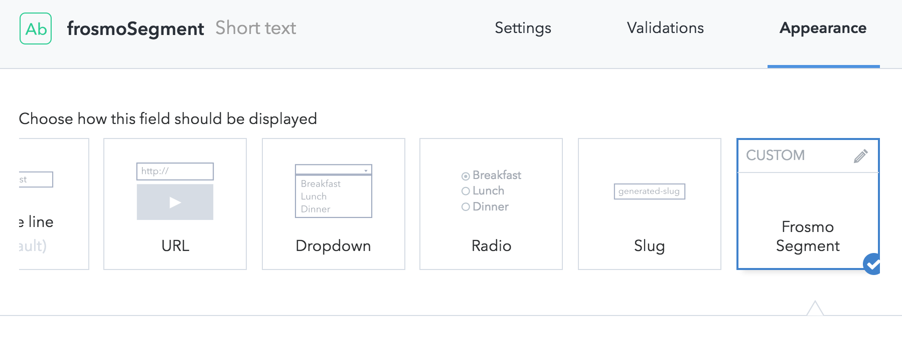
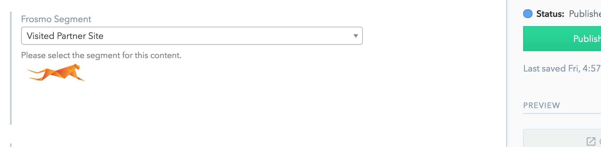

# Contentful UI extension for Frosmo
Allows [Contentful](https://www.contentful.com/) users to select which [Frosmo](https://frosmo.com) segment is tied to the content they're editing.

## Pre-requisites
* You need to have Contentful account & need to know your spaceId
* You need to have Frosmo Graniitti url, token & siteId
  * You can find Frosmo Graniitti url & create a token in Frosmo Control Panel under Utilities -> Frosmo APIs
  * siteId can be found in Frosmo Control Panel under your account -> Company settings. There you'll see list of sites with siteId

## Install instructions
* Install contentful-cli `npm install -g contentful-cli``
* Edit extension.json and add (Frosmo Graniitti) url, token & siteId
  * In extension.json change `baseUrl` parameter `default: ''` -> to your Graniitti url
  * In extension.json change `token` parameter `default: ''` -> to your Graniitti token
  * In extension.json change `siteId` parameter `default: ''` -> to your Frosmo siteId

* Create the extension to your space by running: `contentful extension create --descriptor extension.json --srcdoc index.html --space-id [YOUR SPACE ID]`
* Extension should be added to your Contentful space

### Updating extension
If you need to update the extension you can use following command:
`contentful extension update --descriptor extension.json --srcdoc index.html --space-id [YOUR SPACE ID] --force`

## Usage in Contentful

### Add to content model
* Go to "Content model" -> select Content type -> add field
* Select "Text" -> give field name (eg. Frosmo segment) -> Click "Create and configure" -> Select "Appearance" -> "Frosmo audiences"

* Go and edit content -> you should see "Frosmo segment" select box listing all segments for the site you configured in extension.json

## Usage in code
* Contentful API needs to be queried to match the segment field, eg. (fields.frosmoSegment contains Frosmo segment name):
https://cdn.contentful.com/spaces/[SPACE_ID]/entries?content_type=[CONTENT_TYPE]&fields.frosmoSegment=[SEGMENT_NAME]&select=fields&access_token=[ACCESS_TOKEN]
* Note that it works with Segment name, not Segment ID.